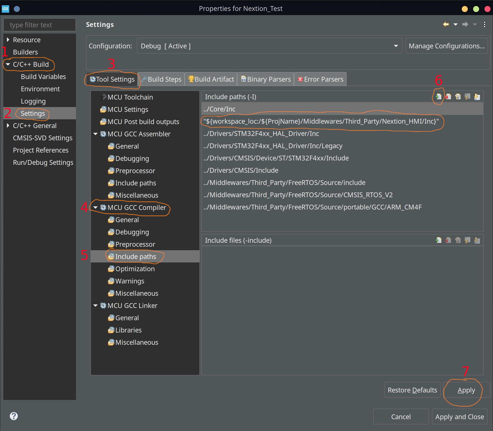
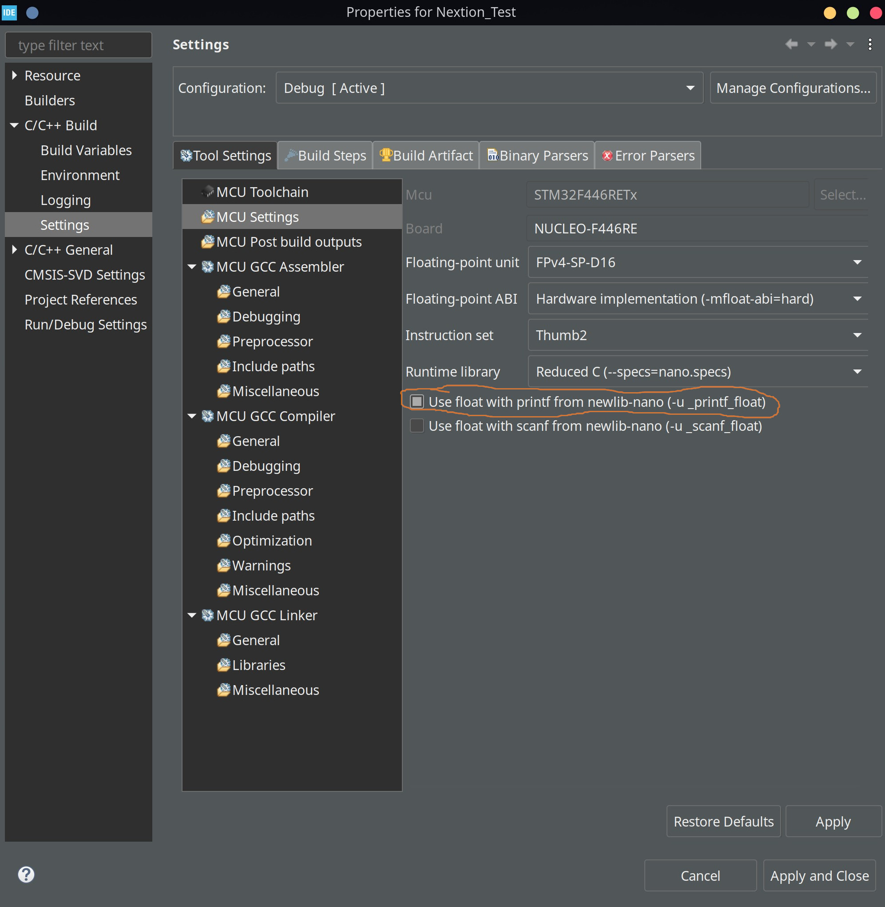
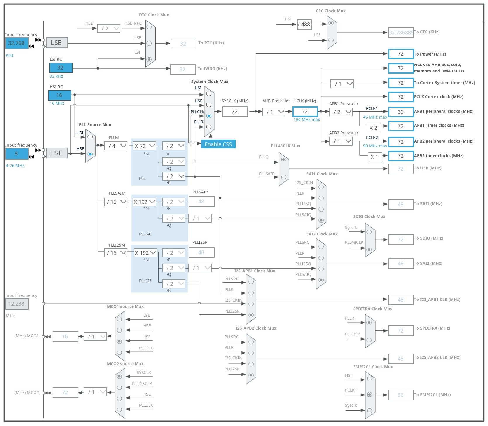
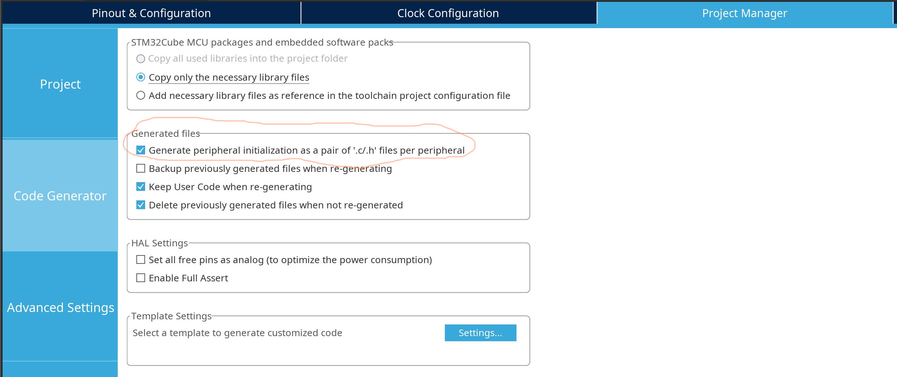
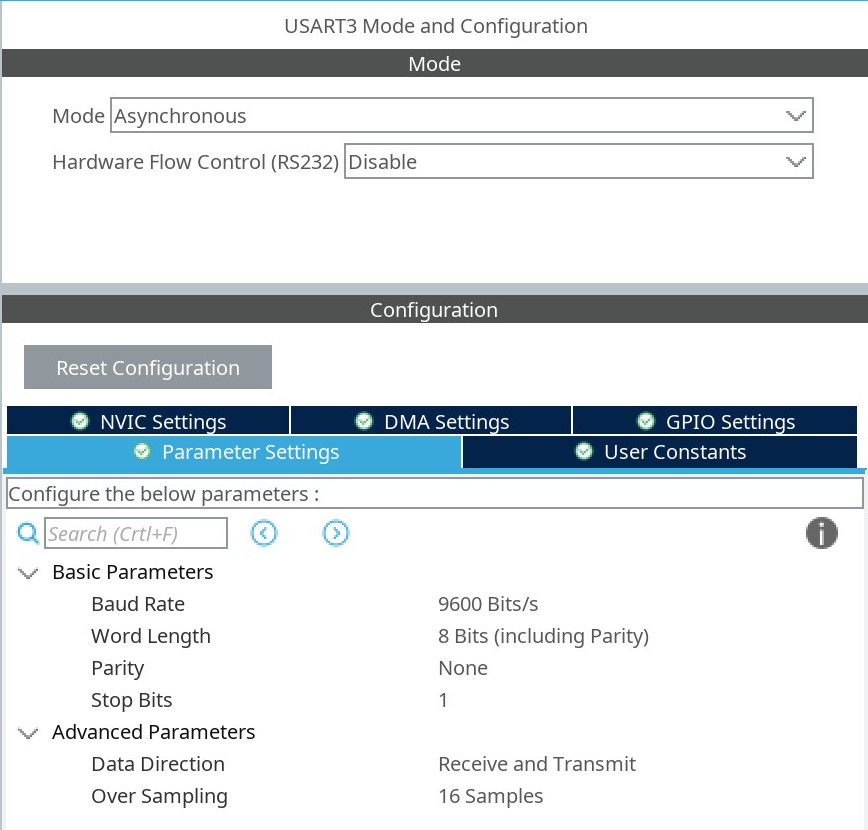
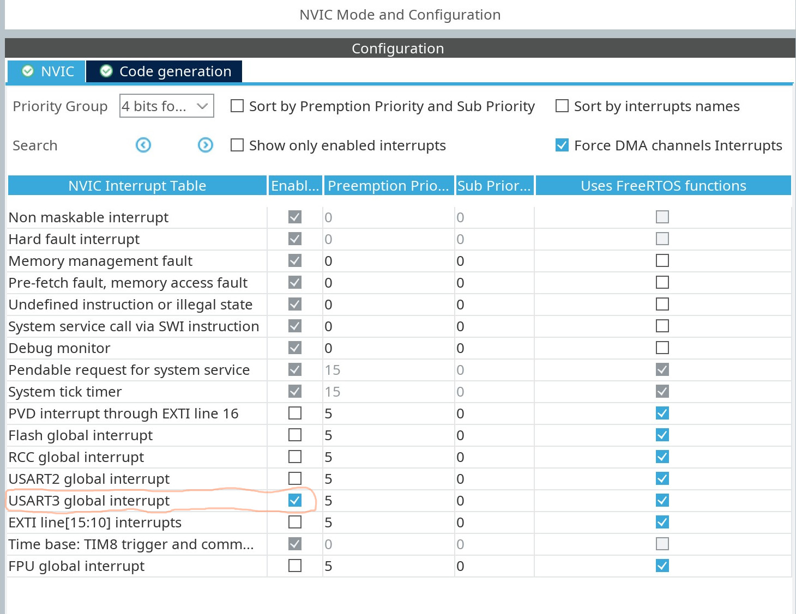
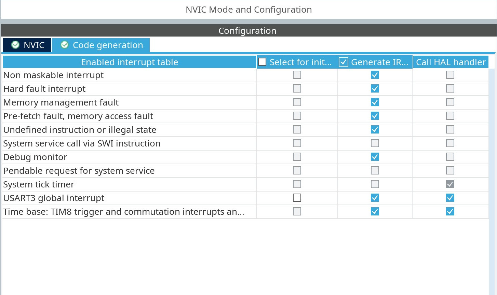
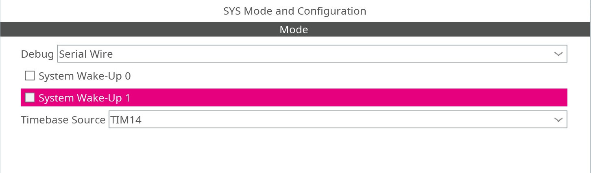
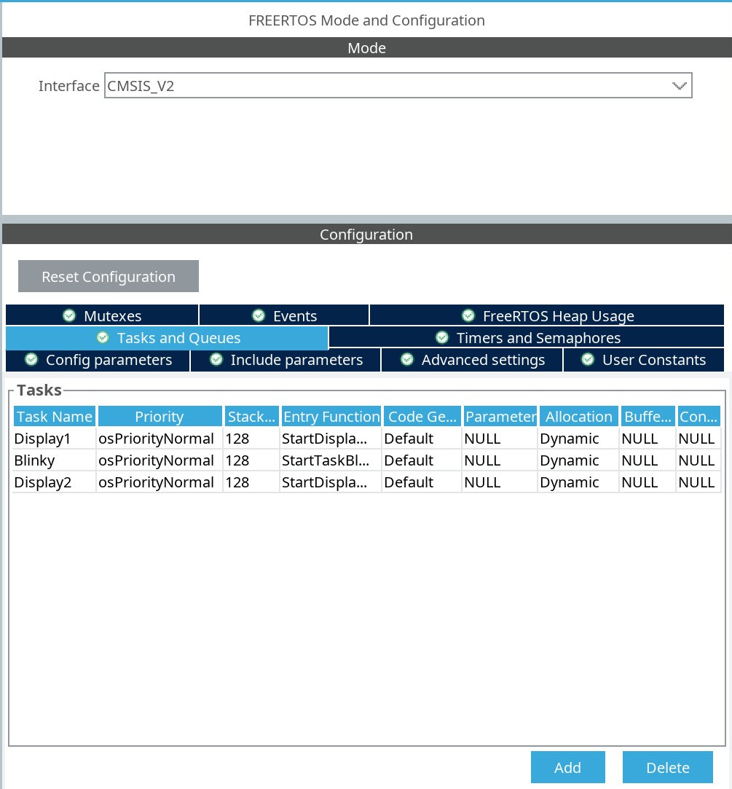

# 

### Include files

Copy the "Nextion_HMI" folder in to your project, then include to your project the "Inc" folder. 

Steps are: 

Right click on to your project Name, then choose Properties

Click on to "C/C++ Build  -  Settings"

Click on Add under ToolSettings/MCU GCC Compiler/IncludePaths

Click on Workspace and choose the "Nextion_HMI/Inc" folder

Click on Apply

### Configure printf

Click on MCU Settings, Use float with printf

Click on Apply and Close

### Clock Source Config

This is my chosen clock settings, configure according your needs.

### File generating config

### UART Config

Choose the UART you want to use.

Mode: Asynchronous.

Parameters: 9600, 8 N 1

### NVIC Config

Enable Global Interrupt for chosen UART

Tick mark Generate IRQ Handler for chosen UART

### SysTick Source

Choose an a unused timer for Timebase Source. (FreeRTOS will use SysTick timer)

### FreeRTOS config

Enable FreeRTOS, choose CMSIS_V2 and create tasks

